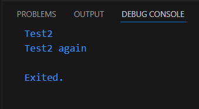

# Pemrograman Mobile - Pertemuan 4

Nama : Filla Ramadhani Utomo

NIM : 2241720209

Kelas : TI-3F

<br>

## Praktikum 1

#### Langkah 2

##### Kode Program

```dart
void main(){
    String test = "test2";
  if (test == "test1") {
    print("Test1");
  } else if (test == "test2") {
    print("Test2");
  } else {
    print("Something else");
  }

  if (test == "test2") {
    print("Test2 again");
  }
}
```

Penjelasan: Terjadi eror pada output. Ada tiga kesalahan yaitu:

- Pada baris ke-5 penulisan 'IF' seharusnya 'if'
- Pada baris ke-7 penulisan 'Else' seharusnya 'else
- pada baris ke-11 harus diberi kurung kurawal



#### Langkah 3

##### Kode Program

```dart
void main(){
    String test = "test2";
  if (test == "test1") {
    print("Test1");
  } else if (test == "test2") {
    print("Test2");
  } else {
    print("Something else");
  }

  if (test == "test2") {
    print("Test2 again");
  }

  String test3 = "true";
    if (true) {
      print("Kebenaran");
  }
}
```

Penjelasan: Akan terjadi error, karena variabel 'test' sudah di definisikan dan pada if harus bernilai boolean.


<br>

## Praktikum 2

#### Langkah 2

##### Kode Program

```dart
void main(){
  int counter = 0;
    while (counter < 33) {
    print(counter);
    counter++;
  }
}
```

Penjelasan: terjadi error karena variabel 'counter' belum di inisiasi


#### Langkah 3

##### Kode Program

```dart
void main(){
  int counter = 0;
    while (counter < 33) {
    print(counter);
    counter++;
  }

  do {
    print(counter);
    counter++;
  } while (counter < 77);
}
```

Penjelasan: Kode berhasil dijalankan dan outputnya sesuai


## Praktikum 3

#### Langkah 2

##### Kode Program

```dart
void main() {
  int index;
  for (index = 10; index < 27; index++) {
    print(index);
  }
}
```

Penjelasan : Terjadi error karena variabel 'index' belum diinisiasi dan beberapa penulisan 'index' masih salah yaitu 'Index'


#### Langkah 3

##### Kode Program

```dart
void main() {
  int index;
  for (index = 10; index < 27; index++) {
    if (index == 21) {
      break;
    } else if (index > 1 && index < 7) {
      continue;
    }
    print(index);
  }
}

```

Penjelasan : Terjadi error karena kesalahan penulisan 'if' 'else', tidak ada kurung kurawal, seharusnya berada di dalam perulangan, dan operator || yang seharusnya &&


## tugas praktikum

```dart
void main(){
  for(int prima = 0; prima <= 201; prima++){
    if(prima == 0) {
      continue;
    }else if((prima % 2 == 0) && (prima != 2)){
      continue;
    }else if(prima == 1){
      continue;
    }else if((prima % 3 == 0) && (prima != 3)){
      continue;
    }else if(prima % 5 == 0 && prima != 5){
      continue;
    }else if(prima % 7 == 0 && prima != 7){
      continue;
    }else if(prima % 11 == 0 && prima != 11){
      continue;
    }else if(prima % 13 == 0 && prima != 13){
      continue;
    }
    print("$prima :Filla Ramadhani Utomo - 2241720209");
  }
}
```


