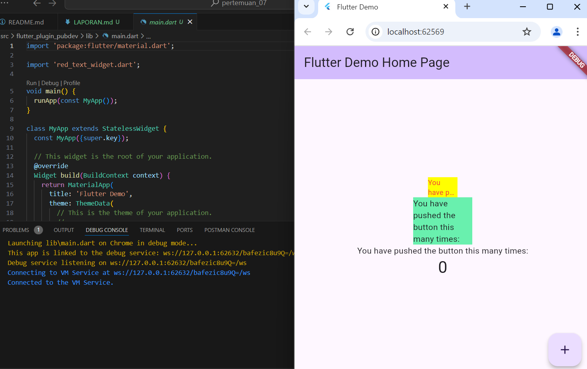

# Pemrograman Mobile - Pertemuan 7

Nama : Filla Ramadhani Utomo

NIM : 2241720209

 

## Praktikum

 
 

## Tugas Praktikum
2. Menambah plugin ke dalam projek flutter yaitu **auto_rezise_text**. Cara menambahkannya dengan mengetik **flutter pub add auto_size_text** pada terminal
 

3. Membuat variabel text agar tidak terjadi error pada langkah ke 4 dan menambah parameter di constructor agar widget dapat menerima parameter text
 

4. * **RedTextWidget** merupakan custom widget yang sudah dibuat pada langkah sebelumnya. Fungsinya untuk meng custom sebuah text dengan lebih banyak opsi perubahan tampilan karena sudah ditambahkan plugin
    * **Text** merupakan widget bawaan dari flutter. Tidak seperti **RedTextWidget**, **Text** widget hanya bisa dirubah dengan sedikit opsi perubahan tampilan
 

5. |Parameter|Deskripsi|
    |-------|-------|
    |key*|Digunakan untuk mengontrol bagaimana 1 widget mengganti widget lain di dalam tree|
    |textKey|Mengatur key untuk menghasilkan **Text** widget|
    |style*|Jika bernilai non-null, style akan diterapkan pada text |
    |minFontSize| Batas ukuran minimum text yang akan diterapkan ketika proses **auto-sizing text**, akan diabaikan jika mengaktifkan **presentFontSize**|
    |maxFontSize| Batas ukuran maksimum text yang akan diterapkan ketika proses **auto-sizing text**, akan diabaikan jika mengaktifkan **presentFontSize**|
    |stepGranularity| Memberikan ukuran text berdasarkan batasan yang diberikan|
    |presetFontSizes| Mendefinisikan semua kemungkinan ukuran font, **penting: presetFontSizes** harus dalam urutan menurun|
    |group| Menyinkronkan ukuran beberapa AutoSizeText|
    |textAlign*|Mengatur bagaimana text harus disejajarkan secara horizontal|
    |textDirection*|Menentukan bagaimana nilai textAlign seperti TextAlign.start dan TextAlign.end diinterpretasikan|
    |locale*| Digunakan untuk memilih font ketika karakter Unicode yang sama dapat dirender secara berbeda, bergantung pada lokalnya|
    |softWrap*|Untuk menentukan apakah teks harus terputus pada jeda baris|
    |wrapWords| Untuk menentukan apakah kata-kata yang tidak muat dalam satu baris harus dibungkus|
    |overflow*| Mengatur bagaimana cara menangani tampilan yang terjadi overflow|
    |overflowReplacement| Jika teks terjadi overflow dan tidak sesuai batasnya, widget ini akan ditampilkan.|
    |textScaleFactor*| Jumlah piksel font untuk setiap logical pixel. Juga mempengaruhi **minFontSize, maxFontSize dan presetFontSizes**|
    |maxLines| Untuk menentukan jumlah baris maksimum opsional untuk merentangkan teks|
    |semanticsLabel*| Untuk mengatur label semantik pada suatu teks|
