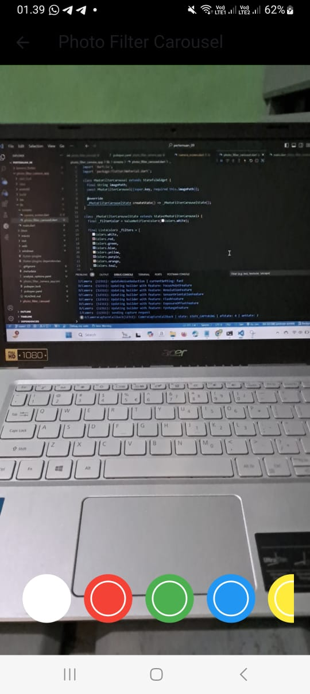

# Pemrograman Mobile - Pertemuan 9

Nama : Filla Ramadhani Utomo

NIM : 2241720209

 

## Praktikum 1

 
 

## Tugas Praktikum
### 2. berikut hasil menggabungkan antara project yang ada pada praktikum 1 dan 2

 

berikut gambar tanpa menggunakan filter warna.

 

 

berikut gambar menggunakan filter warna.

 

 

 

### 3. Jelaskan maksud void async pada praktikum 1?

JAWAB : Pada Praktikum 1, penggunaan void dan async dalam fungsi menandakan beberapa hal yang penting dalam pemrograman asinkron di Dart (bahasa pemrograman Flutter). Karena, penggunaan async membuat pengalaman pengguna menjadi lebih halus karena aplikasi tidak akan “hang” atau berhenti saat operasi berjalan. Fungsi tetap dapat berjalan tanpa memblokir UI (antarmuka pengguna), yang memungkinkan aplikasi tetap responsif. Jadi, secara keseluruhan, void async pada Praktikum 1 berarti fungsi tersebut tidak akan mengembalikan nilai dan dapat berjalan secara asinkron tanpa memblokir tugas utama aplikasi.

 

### 4. Jelaskan fungsi dari anotasi @immutable dan @override ?

JAWAB : Anotasi @immutable dan @override adalah anotasi penting dalam Flutter dan Dart, yang membantu meningkatkan konsistensi dan keamanan kode. 

Anotasi immutable
- Anotasi @immutable digunakan untuk menandai kelas sebagai immutable, yang berarti nilai properti objek kelas tersebut tidak dapat diubah setelah objek dibuat.
- Anotasi ini biasanya diterapkan pada kelas yang menggunakan StatelessWidget.
- Dalam konteks Flutter (terutama untuk widget), membuat kelas immutable membantu memastikan bahwa widget tidak akan mengalami perubahan status internal. Ini juga membuat widget lebih aman dan mudah di-debug, karena statusnya tetap sama selama masa hidupnya.

 

Anotasi Overide
- Anotasi @override digunakan ketika suatu metode dalam kelas menimpa (override) metode dari kelas induk (superclass).
- Anotasi ini tidak mengubah perilaku program, tetapi membantu menghindari kesalahan penulisan kode, seperti salah ketik nama metode atau parameter.
- Dart akan memberikan peringatan jika metode yang ditandai dengan @override tidak ditemukan di kelas induk. Ini memastikan bahwa metode tersebut benar-benar berasal dari superclass dan dikonfigurasi dengan benar.